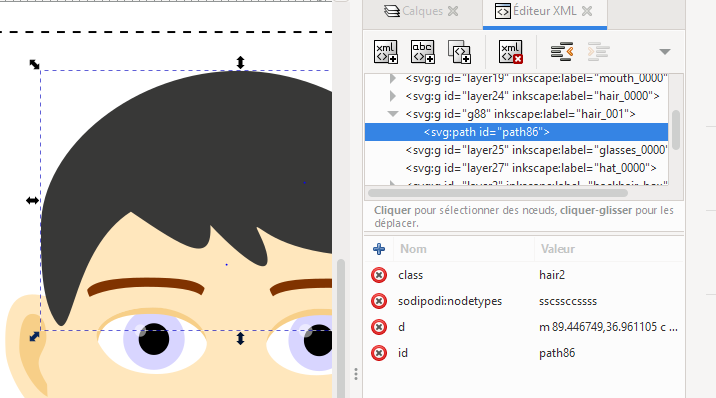
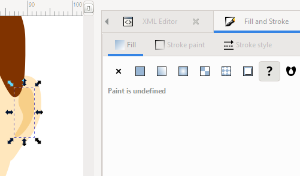

# avatar-parts
Contains svg parts to generate emoji-style bust avatars

# Contributing

## Setup your workspace

Fork this repository on github and clone your fork locally.

We made a [template.svg](template.svg) with inkscape. This template contains layers named [part]_box for each part. These layers show the bounding box of each part.

There are also layers named [part]_0000 that contains a default template part for each part.

Start by copying **template.svg** to **work.svg**

You should make your own parts in separate layers named [part]_[n] with *part* being the part name (bust, ears, eyes, ...) and *n* being a **3 digits** number (or lower) if you are making a new part. If you are modifying an existing part, you should use the **4 digits** number assigned to your part.

## Working with the palette

A color palette is embeded inside *template.svg* as css classes. This is used to allow the end user to select colors for avatar parts. The palette consists of the following colors

class name | default | usage
---------- | ------- | -----
flesh      |  | main flesh elements
flesh2     |  | flesh shadows
flesh3     |  | lighter flesh
hair       |  | main hair
hair2      |  | hair shadows / darker hair
eye        |  | eye color
p1         |  | palette 1
p2         |  | palette 2
p3         |  | palette 3
p4         |  | palette 4

To use the palette with inkscape you have to open the **XML Editor** located in the *Edit* menu. You can then click on an object (or path) and set a "class" attribute with the class name (i.e. "flesh") you desire.

If the palette color does not show on the object, you may have to set the fill color to undefined in the **Fill and Stroke** menu. This will make your object inherit its color from the palette.

Although you should use the palette as much as possible, you can use hardcoded colors as well. Using black or white objects with custom opacities can be usefull to add shadows or highlights over palette colors.

## Testing your changes

You can run the frontend locally to test your new parts with the others.

To do this you need to clone the [avatar-web](https://github.com/profile-generators/avatar-web) git repository, add the *parts* directory from this repository in the *webroot* directory and finally run a static files webserver from the *webroot* directory.

The easiest way to make a static file webserver is to use a Node.js package called *http-server*: 
- Install Node.js for you system from [https://nodejs.org/en/download/](https://nodejs.org/en/download/)
- Install the http-server package globally with `npm install --global http-server`
- browse to the *webroot* directory
- run `http-server`
- your can now access your server at [http://127.0.0.1:8080/](http://127.0.0.1:8080/)
- in your browser, force refresh with <kbd>ctrl</kbd>+<kbd>f5</kbd> when you add a new part

## Pushing your updates
When your layers are ready, run the python 3 script [extract_svg.py](extract_svg.py).

`extract_svg.py src_svg dst_folder author`

*src_svg* is your svg file containing parts as layers (work.svg)

*dst_folder* is the output folder (the parts folder)

*author* will be added as metadata to your parts

The script will extract your layers and assign a **4 digit** number to each of your parts, add author and tags metadata inline, and place your part in the correct folder. If you used **4 digit** in a layer name, the corresponding part will be updated instead of being assigned a new number.

When extract_svg.py runs:
- for each new part one or more keywords are requested. You can pass, or enter keywords separated by commas. Space is to be replaced by an underscore. Keywords will be added as metadata to your parts.
- information will be asked to associate hair and eventually back hair.

Before making a pull request, run the python 3 script [gen_indexes.py](gen_indexes.py).

`gen_indexes.py`

The script has no arguments and will build the static indexes containing the list of parts in each part folder.

Commit and push everything to your fork.

You can now make a pull request to integrate your new parts to the main repository.

# License
Code is licensed under GPL-3.0 unless stated otherwise

Medias are licensed under CC-BY-4.0 unless stated otherwise